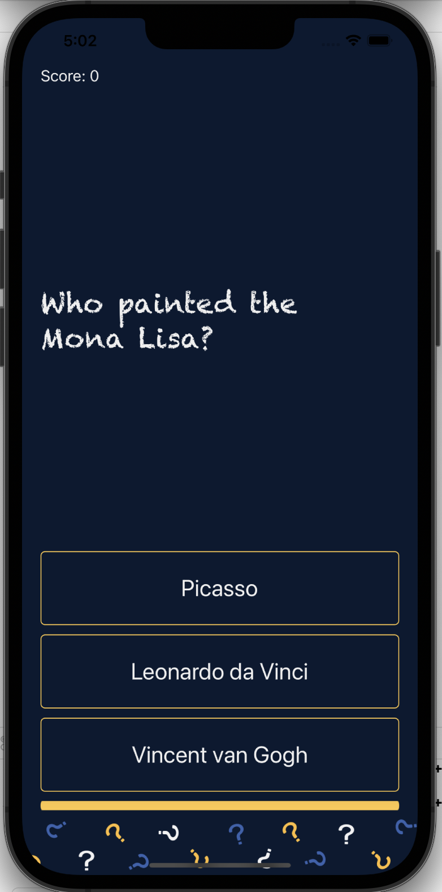
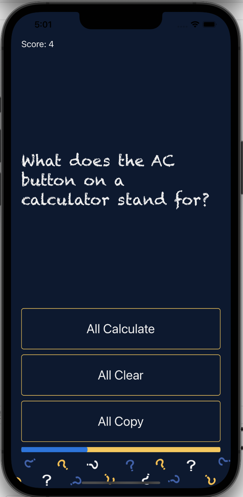

# Xylo 

Quizzoo is a fun quiz app built for iphone and ipad in swift.

* **Choose** from three options.
* **Check** your score.
* **Keep** track of your progress.

## Technologies used in this project:

 

## User interface:

Works with **iphones** and **ipads** of different screen sizes.

  

Check the **score** and **track** your progress.

  

## Note

Feel free to download the project and build upon it. You can add
new features, refactor the code if you'd like and improve 
the overall experience. Happy coding!
